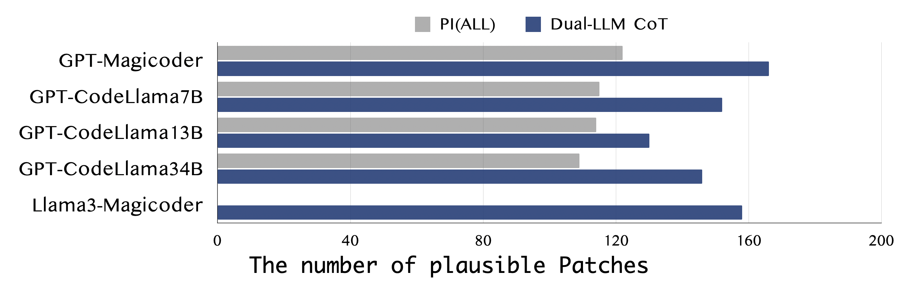
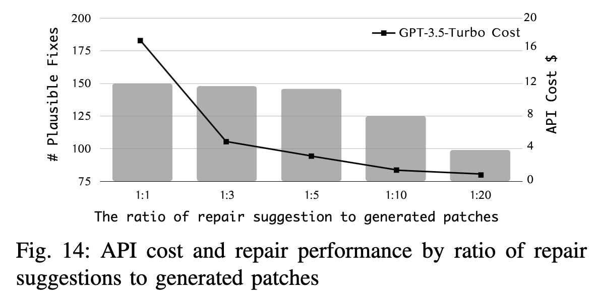

# About *Function-level APR* &. *SRepair*

This artifact repository provides all data, replication procedures, and code for public evaluation. Specifically, all the patches in study section and correct patches generated by SRepair are provided in `./Study/patch`  folder and `./SRepair/correct_patch` folder. Furthermore, we attempt to include some supplementary materials and findings from the research process in the Supplementary Material section which are omitted due to the page limit in our paper.

# Quick Start

### **Environment requirements**

**OS**: A Linux system with **[Docker](https://docs.docker.com/engine/install/)** support. (Optional: [NVIDIA Docker](https://github.com/NVIDIA/nvidia-docker) support)

**GPUs:** NVIDIA GPU(s) with >20G memory (For Magicoder 7B patch generation)

Specifically, you need to select the PyTorch installation according to your GPU and the version of CUDA you are using. For more details, please refer to https://pytorch.org/get-started/locally/.

### Docker install

We provide a Dockerfile for setting up the APR environment directly. First, build the LLM4APR image using the Dockerfile.

```docker build ./ --tag llm4apr```

Then create a container from the image and run:

```docker run -it --name llm4apr_ctn llm4apr```
or 
```docker run -it --gpus all --name llm4apr_ctn llm4apr ```
to enable gpus in docker. (See [NVIDIA Docker](https://github.com/NVIDIA/nvidia-docker))

### Download OpenSrc Models

You can utilize the scripts we provide to pre-download the models to your local environment, facilitating subsequent experiments. Specifically, please download the models individually as needed from the `pull_models.py` script.

# Reproduce Study

## Model configuration

We utilized the following models, with specific parameters and relevant references shown in the table below.
    
| Models | Parameter Size | Link |
| --- | --- | --- |
| GPT-3.5-Turbo-1106 | - | https://platform.openai.com/docs/models/gpt-3-5-turbo |
| Codex-Edit | - | https://openai.com/blog/gpt-3edit-insert |
| Magicoder | 7B | https://huggingface.co/ise-uiuc//Magicoder-S-CL-7B
| CodeLlama-Instruct | 7B | https://huggingface.co/codellama/CodeLlama-7b-Instruct-hf |
| CodeLlama-Instruct | 13B | https://huggingface.co/codellama/CodeLlama-13b-Instruct-hf |
| CodeLlama-Instruct | 34B | https://huggingface.co/codellama/CodeLlama-34b-Instruct-hf |

Specifically, to use the GPT-3.5-Turbo or Codex-Edit model, you should set your own OpenAI API key by adding os.environ['OPENAI_API_KEY'] = 'your-api-key' in the file ./Study/src/apr_gen_patch.py."

## Study: Patch Generation

To generate patches, execute `./Study/src/apr_gen_patch.py` as follows:
    
```java
cd /path/to/repo/
python3 ./Study/src/apr_gen_patch.py -d ./Study/dataset/defects4j-sf.json -o ./math2_patches.json -m chatgpt -s 2 -bug Math-2
```

It will generate patches with sample size=2 by chatgpt model for bug Math-2. If you wish to explore more diverse APR settings, such as sampling 20 patches for all single function bugs, you can further refer to the parameter settings. 
    
<details><summary>parameter setting</summary>
<div>

Below, we will provide a detailed explanation of the parameters for this method:

- `d`: Specifies the path to the dataset. This argument is required.
- `o`: Specifies the path to the patch result. This argument is required.
- `m`: Specifies the model to be used. This argument is required. Specifically, we have six different models, and to simplify command-line input, we have abbreviated their names.
  
  | Models | Abbreviation |
  | --- | --- |
  | GPT-3.5-Turbo | chatgpt |
  | Codex-Edit | codex-edit |
  | Magicoder | magicoder |
  | CodeLlama 7B | cl7b |
  | CodeLlama 13B | cl13b |
  | CodeLlama 34B | cl34b |

- `s`: Specifies the sample size. This argument is optional, with a default value of 1.
- `bug`: Specifies the bug. This argument is optional.
- `k`: Specifies the k-shot learning setting. This argument is optional, with a default value of 0.
- `ce`: Specifies whether to use crafted examples. This argument is optional and defaults to False.
- `fl`: Specifies whether to use fault localization information. This argument is optional and defaults to False.
- `info`: Specifies repair information using a predefined format. This argument is optional and has a default value of an empty string. Specifically, we have totally seven different settings.
        
        
    | Repair Information  Setting | Abbreviation |
    | --- | --- |
    | Issue Title | it |
    | Issue Description | id |
    | Bug Report (Issue Title + Issue Description) | br |
    | Trigger Test | tt |
    | Error Message | em |
    | Buggy Comment | bc |
    | Project Information(Trigger Test + Error Message + Buggy Comment) | pi |

These parameters are used to configure and control the behavior of the program when generating patches.
</div>
</details>

## Study: Patch Validation

After generating patches (or directly using the patches provided by us), you can further validate them to determine their status, such as plausible, test-failure, or uncompilable.
    
```java
python3 ./Study/src/val_d4j.py -i ./math2_patches.json -o ./math2_patches_val -d ./Study/dataset/defects4j-sf.json
```

<details><summary>parameter setting</summary>
<div>

Based on these parameters:

- `i`: Specifies the patch file path. This argument is required.
- `o`: Specifies the validation result output path. This argument is optional and defaults to `/tmp/llm4apr_validation/result`.
- `d`: Specifies the validation dataset path. This argument is optional.
- `log`: Specifies whether to enable logging mode. This argument is optional and activates logging to `validation.log` when enabled.

These parameters are used for configuring the validation process for patches, including input/output paths and logging options.

</div>
</details>


# Reproduce SRepair

## SRepair: Repair Suggestion

To generate suggestions for single function bugs, execute `./SRepair/src/sf_gen_solution.py` as follows:

```java
python3 ./SRepair/src/sf_gen_solution.py -d ./SRepair/dataset/defects4j-sf.json -o ./math2_solution.json -s 2 -bug Math-2
```

It will query chatgpt model twice, generating multiple distinct bug-fixing suggestions for bug Math-2. Its raw output will be stored in the file `./math2_solution.json`, and the extracted suggestions will be stored in `./math2_solution_extracted.json`. Below is the detailed parameter setting. 

<details><summary>parameter setting</summary>
<div>

Below, we will provide a detailed explanation of the parameters for this method:

- `d`: Specifies the path to the dataset. This argument is required.
- `o`: Specifies the path to the raw output. This argument is required.
- `eo`: Specified the path to extracted suggestions. This argument is optional.
- `s`: Specifies the sample size. This argument is optional, with a default value of 1.
- `bug`: Specifies the bug to generate suggestion for. This argument is optional.

These parameters are used to configure and control the behavior of the program when generating suggestions.
</div>
</details>

To generate suggestions for multi-function bugs, execute `./SRepair/src/mf_gen_solution.py` as follows:

```java
python3 ./SRepair/src/mf_gen_solution.py -d ./SRepair/dataset/defects4j-mf.json -o ./chart19_solution.json -s 2 -bug Chart-19
```

Its usage is similar to `sf_gen_solution.py`, except that it will only generate one distinct suggestion per query, so the above command will only generate two distinct suggestions for bug Chart-19.

## SRepair: Patch Generation

To generate patches for single function bugs, execute `./SRepair/src/sf_gen_patch.py` as follows:

```java
python3 ./SRepair/src/sf_gen_patch.py -d ./SRepair/dataset/defects4j-sf.json -s ./math2_solution_extracted.json -o ./math2_patches.json -bug Math-2
```

It will generate patches by Magicoder model for bug Math-2, with its sample size decided by the number of provided suggestions (5 patches for each suggestion). Below is the detailed parameter setting. 

<details><summary>parameter setting</summary>
<div>


Below, we will provide a detailed explanation of the parameters for this method:

- `d`: Specifies the path to the dataset. This argument is required.
- `s`: Specifies the path to the suggestions. This argument is required.
- `o`: Specifies the path to the generated patch. This argument is required.

- `bug`: Specifies the bug to generate suggestion for. This argument is optional.
  </div>
  </details>

To generate patches for multi-function bugs, execute `./SRepair/src/mf_gen_patch.py` as follows:

```java
python3 ./SRepair/src/mf_gen_patch.py -d ./SRepair/dataset/defects4j-mf.json -s ./chart19_solution_extracted.json -o ./chart19_patches.json -bug Chart-19
```

Its usage is similar to `sf_gen_patch.py`.

## SRepair: Patch Validation

For single function bugs, the validation process is identical to that in study part, since the format of generated patches is not changed.

```java
python3 ./SRepair/src/sf_val_d4j.py -i ./math2_patches.json -o ./math2_patches_val -d ./SRepair/dataset/defects4j-sf.json
```

For multi-function bugs, they can be validated by executing `./SRepair/src/mf_val_d4j.py` as follows:

```java
python3 ./SRepair/src/mf_val_d4j.py -i ./chart19_patches.json -o ./chart19_patches_val -d ./SRepair/dataset/defects4j-mf.json
```

And its parameter setting is still the same as the setting of single function validation.

# Supplementary materials

## Supplementary material of CodeLlama models: Abnormal Patch Generation Behavior

As shown in the code block below, these patches are generated using the Codellama-34B model. We discovered that the Codellama-34B model, when faced with defective Java code (such as in Defects4J Chart-4), unexpectedly generates Python code annotated with [PYTHON]. 
```
\n[PYTHON]\ndef get_fixed_function(function_string):\n    # Delete the entire fixed function from the string\n    function_string = function_string.replace(\n\"\"\"\nprotected AxisState drawLabel(String label, Graphics2D g2, \n        Rectangle2D plotArea, Rectangle2D dataArea, RectangleEdge edge, \n        AxisState state, PlotRenderingInfo plotState) {\n\n    // it is unlikely that 'state' will be null, but check anyway...\n    if (state == null) {\n        throw new IllegalArgumentException(\"Null 'state' argument.\");\n    }\n    \n    if ((label == null) || (label.equals(\"\"))) {\n        return state;\n    }\n\n    Font font = getLabelFont();\n    RectangleInsets insets = getLabelInsets();\n    
```
For more details, please check the example patches in `./resource/abnormal_patch.json`.


## Supplementary material of RQ1: Crafted Examples and K-Shot

While prior work only utilizes one crafted example (binarySearch), we also aim to incorporate various crafted examples created by us to investigate the performance impact. Specifically, we conduct the experiment only 277 single-function bugs in Defects4J 1.2 and sample 200 times using Codex-Edit model. The evaluation result is shown in Table below.

| Setting | Crafted Example | # Codex-Edit Plausible Patch|
| --- | --- | --- |
| K1(CE) | BinarySearch | 65 |
| K1(CE) | Fibonacci | 70 |
| K1(CE) | Bubble Sort | 63 |
| K2(CE, CE) | BinarySearch & Fibonacci | 63 |
| K2(CE, CE) | BinarySearch & Bubble Sort | 58 |

Furthermore, we also attempt to investigate the performance of few-shot learning with different repair information. Following table is different few-shot learning settings (from K=1 to K=3) with bug report relevant information (BR:bug report, IT: issue title, ID: issue description, ALL: whole bug report), and ‘_FL’ represents the settings with statement-level fault locations. Specifically, we apply the Codex-Edit model and sample size=200, and the result is the number of plausible fixes. We can observe that even with different repair information (bug report or fault locations), few-shot learning leads to disparate plausible fix results in function-level APR.

| Codex-Edit (200) | Basic | BR(IT) | BR(ID) | BR(ALL) |
| --- | --- | --- | --- | --- |
| K0(Basic) | 174 | 265 | 281 | 301 |
| K1(PE) | 109 | 210 | 215 | 264 |
| K1(CE) | 103 | 183 | 200 | 224 |
| K2(PE, PE) | 165 | 256 | 223 | 236 |
| K2(CE, PE) | 138 | 208 | 209 | 234 |
| K3(PE, PE, PE) | 142 | 263 | 162 | 168 |
| K3(CE, PE, PE) | - | 226 | 185 | 184 |
|  |  |  |  |  |
| K0(Basic)_FL | 225 | 300 | 299 | 312 |
| K1(PE)_FL | 184 | 255 | 242 | 276 |
| K1(CE)_FL | 151 | 214 | 218 | 240 |
| K2(PE, PE)_FL | 211 | 270 | 235 | 235 |
| K2(CE, PE)_FL | 196 | 240 | 226 | 269 |
| K3(PE, PE, PE)_FL | 210 | 260 | 193 | 185 |
| K3(CE, PE, PE)_FL | 206 | 255 | 207 | 214 |


## Supplementary material of  SRepair: Configuration Study
 


We further attempt to investigate the different configurations and costs of SRepair. Due to the substantial cost of invoking different settings in this study, we limit the sample size to 200 and only focus on 277 single-function bugs in Defects4J 1.2. Moreover, due to the intensive manual efforts involved in patch inspection, we focus on the number of plausible fixes. Firstly, we experiment with different open-source patch generation models in the Dual-LLM CoT framework, while keeping GPT-3.5-Turbo as the suggestion generation model unchanged in the PI(ALL) setting. The evaluation results are presented in Figure 13. Interestingly, we can find that all open-source code models we studied benefit from the Dual-LLM CoT framework, with improvements in plausible fixes ranging from 12.1% to 36.1%. More specifically, we observe that Magicoder  (GPT-Magicoder) achieves the most significant repair performance, with 166 plausible fixes and an improvement of 36.1% compared to the PI(ALL) setting.  

To further demonstrate the generalizability and robustness of SRepair, we experimented with open-source models as the repair suggestion model. Specifically, we use the newly released Llama3-8B model[4] for repair suggestions and continue using MagicoderS-CL for patch generation(Llama3-Magicoder setting). Interestingly, the Llama3-8B model demonstrate superior repair performance, with Llama3-8B as the repair suggestion model plausibly fixed 158 bugs, which is close to, though slightly inferior to, the current SRepair version that utilized GPT-3.5-Turbo (158 vs. 166). Such experimental data demonstrates the potential of open-source models in contributing to effective repair suggestions. This indicates that SRepair can be adapted and optimized with different LLMs, providing greater transparency regarding its inner workings and training data. The relevant data and patches are located at `./resource/srepair-llama3-patches.zip`.

To further demonstrate SRepair's repair performance and address data leakage issues, we conducted experiments on the GrowingBugs[1-3] dataset, an expanded version of Defects4J that includes more recent Java projects and bug fixes. Of the 988 single-function bugs in GrowingBugs, SRepair plausibly fixed 705, achieving a fix rate of 71.4%. This result even surpasses the 68.6% plausible fix rate on Defects4J, highlighting SRepair's superior performance and generalizability.  The relevant data and patches are located at `./resource/growingbug_plausible_patches.tar`.




We also investigate the relationship between the cost and repair performance by ratio of repair suggestions to generated patches as shown in Figure 14. Notably, to better balance the repair performance and the API cost, we set the patch generation ratio for SRepair at 1:5; that is, for each repair suggestion, the patch generation model generates 5 patches. Moreover, for the SRepair500 single-function experiments, the total GPT-3.5-Turbo API cost is only \$8.6, with the average cost per correctly fixed bug at \$0.029, making SRepair an efficient LLM-based APR technique.


# Reference

[1] Y. Jiang, H. Liu, N. Niu, L. Zhang, and Y. Hu, “Extracting Concise Bug-Fixing Patches from Human-Written Patches in Version Control Systems,” in *IEEE/ACM 43rd International Conference on Software Engineering (ICSE 2021)*, May 2021, pp. 686–698. doi: 10.1109/ICSE43902.2021.00069.

[2] Y. Jiang *et al.*, “BugBuilder: An Automated Approach to Building Bug Repository,” *IEEE Transactions on Software Engineering*, pp. 1–22, 2022, doi: 10.1109/TSE.2022.3177713.

[3] Y. Jiang, H. Liu, Y. Zhang, W. Ji, H. Zhong, and L. Zhang, “Do Bugs Lead to Unnaturalness of Source Code?,” in *Proceedings of the 30th ACM Joint European Software Engineering Conference and Symposium on the Foundations of Software Engineering*, 2022, pp. 1085–1096. doi: 10.1145/3540250.3549149.

[4] 2024-09. Llama 3.1. https://llama.meta.com.